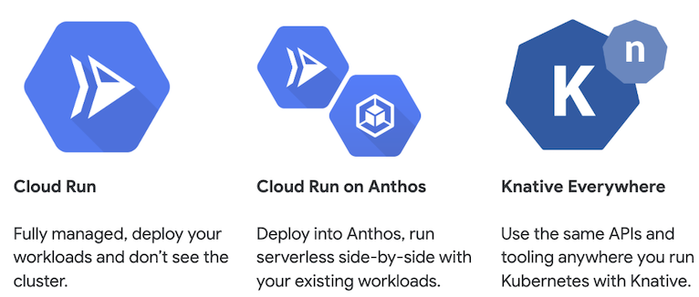
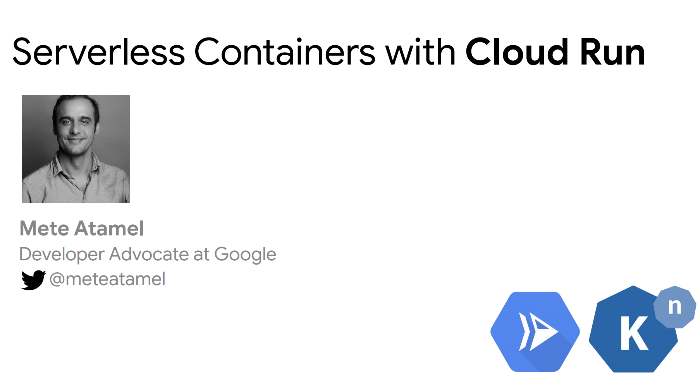

# Cloud Run Tutorial



[Cloud Run](https://cloud.google.com/run/) is a managed serverless platform that enables you to run stateless containers invocable via HTTP requests on Google Cloud.

Cloud Run is built from open-source [Knative](https://knative.dev/), letting you choose to run your containers either fully managed with Cloud Run, or in your Google Kubernetes Engine cluster with Cloud Run on Anthos, or use Knative on any Kubernetes cluster running anywhere.

## Slides

There's a [presentation](https://speakerdeck.com/meteatamel/serverless-containers-with-cloud-run) that accompanies the tutorial.

[](https://speakerdeck.com/meteatamel/serverless-containers-with-cloud-run)

## Setup

[Cloud Run](https://cloud.google.com/run/) is a fully managed service, so
there's no setup other than enabling Cloud Run and Cloud Build.

[Cloud Run for
Anthos](https://cloud.google.com/run/docs/quickstarts/prebuilt-deploy-gke) runs
on GKE on Anthos platform.

Setup your project id and number that we'll need throughout samples:

```bash
export PROJECT_ID="$(gcloud config get-value core/project)"
export PROJECT_NUMBER="$(gcloud projects list --filter=${PROJECT_ID} --format='value(PROJECT_NUMBER)')"
```

Enable Cloud Build and Cloud Run:

```bash
gcloud services enable --project ${PROJECT_ID} \
    cloudbuild.googleapis.com \
    run.googleapis.com
```

## Samples

Cloud Run Serving

* [Public service](docs/public.md)
* [Configure service](docs/configure.md)
* [Private service](docs/private.md)
* [Pub/Sub triggered service](docs/pubsub.md)
* [Storage triggered service](docs/storage.md)
* [Scheduled service](docs/scheduled.md)
* [Task triggered service](docs/tasks.md)
* [Service to service authentication](docs/auth.md)

Cloud Run Eventing

* [Image processing pipeline](docs/image-processing-pipeline.md)
* [Image processing pipeline - GKE](docs/image-processing-pipeline-gke.md)
* [BigQuery processing pipeline](docs/bigquery-processing-pipeline.md)
* [BigQuery processing pipeline - GKE](docs/bigquery-processing-pipeline-gke.md)

Other

* [Scheduled dbt service with BigQuery](docs/scheduled-dbt-service-bigquery.md)

-------

This is not an official Google product.
