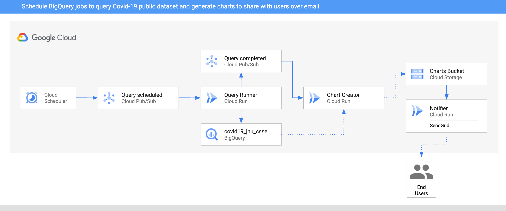

# BigQuery Processing Pipeline

In this sample, we'll build an BigQuery processing pipeline to query some public
dataset on a schedule, create charts out of the data and then notify users about
the new charts via SendGrid with **Eventarc**.



1. Two `CloudScheduler` jobs are setup to call the `QueryRunner` service once
   a day for two countries via PubSub Topic `queryscheduled`.
2. `QueryRunner` receives the scheduler event for both country, queries Covid-19
   cases for the country using BigQuery's public Covid-19 dataset and saves the
   result in a separate BigQuery table. Once done, `QueryRunner` sends a Pub/Sub
   message to `querycompleted` topic.
3. `ChartCreator` receives the event from `querycompleted` topic, creates a
   chart from BigQuery data using `mathplotlib` and saves it to a Cloud Storage bucket.
4. `Notifier` receives the Cloud Storage event from the bucket via an `AuditLog`
   and sends an email notification to users using SendGrid.

## Before you begin

Make sure `gcloud` is up to date and `beta` components are installed:

```sh
gcloud components update
gcloud components install beta
```

[Enable Cloud Audit Logs](https://console.cloud.google.com/iam-admin/audit)
Admin Read, Data Read, and Data Write Log Types for Cloud Storage.

Grant the `eventarc.admin` role to the default compute service account:

```sh
export PROJECT_NUMBER="$(gcloud projects list --filter=$(gcloud config get-value project) --format='value(PROJECT_NUMBER)')"

gcloud projects add-iam-policy-binding $(gcloud config get-value project) \
    --member=serviceAccount:${PROJECT_NUMBER}-compute@developer.gserviceaccount.com \
    --role='roles/eventarc.admin'
```

Grant the `iam.serviceAccountTokenCreator` role to the Pub/Sub service account:

```sh
gcloud projects add-iam-policy-binding $(gcloud config get-value project) \
    --member="serviceAccount:service-${PROJECT_NUMBER}@gcp-sa-pubsub.iam.gserviceaccount.com" \
    --role='roles/iam.serviceAccountTokenCreator'
```

Set region, location and platform:

```sh
export REGION=europe-west1

gcloud config set run/region ${REGION}
gcloud config set run/platform managed
gcloud config set eventarc/location ${REGION}
```

## Create a storage bucket

Create a unique storage bucket to save the charts and make sure the bucket and
the charts in the bucket are all public and in the same region as your Cloud Run
service:

```sh
export BUCKET="$(gcloud config get-value core/project)-charts"
gsutil mb -l $(gcloud config get-value run/region) gs://${BUCKET}
gsutil uniformbucketlevelaccess set on gs://${BUCKET}
gsutil iam ch allUsers:objectViewer gs://${BUCKET}
```

## Setup Cloud Storage for events

Retrieve the Cloud Storage service account:

```sh
export GCS_SERVICE_ACCOUNT=$(curl -s -X GET -H "Authorization: Bearer $(gcloud auth print-access-token)" "https://storage.googleapis.com/storage/v1/projects/$(gcloud config get-value project)/serviceAccount" | jq --raw-output '.email_address')
```

Give the Cloud Storage service account publish rights to Pub/Sub:

```sh
gcloud projects add-iam-policy-binding $(gcloud config get-value project) \
    --member=serviceAccount:${GCS_SERVICE_ACCOUNT} \
    --role roles/pubsub.publisher
```

## Notifier

This service receives the Cloud Storage events and uses SendGrid to send an
email to users that a new chart has been created. You need to setup a SendGrid
account and create an API key. You can follow [this
doc](https://cloud.google.com/functions/docs/tutorials/sendgrid#preparing_the_application)
for more details on how to setup SendGrid.

### Service

The code of the service is in
[notifier](https://github.com/meteatamel/knative-tutorial/tree/master/eventing/processing-pipelines/bigquery/notifier)
folder.

Inside the
[notifier/python](https://github.com/meteatamel/knative-tutorial/tree/master/eventing/processing-pipelines/bigquery/notifier/python)
folder, build and push the container image:

```sh
export SERVICE_NAME=notifier
docker build -t gcr.io/$(gcloud config get-value project)/${SERVICE_NAME}:v1 .
docker push gcr.io/$(gcloud config get-value project)/${SERVICE_NAME}:v1
```

Deploy the service while passing in `TO_EMAILS` to email address where you want
to send the notification and `SENDGRID_API_KEY` with your send SendGrid API Key.

```sh
export TO_EMAILS=youremail@gmail.com
export SENDGRID_API_KEY=yoursendgridapikey
gcloud run deploy ${SERVICE_NAME} \
  --image gcr.io/$(gcloud config get-value project)/${SERVICE_NAME}:v1 \
  --update-env-vars TO_EMAILS=${TO_EMAILS},SENDGRID_API_KEY=${SENDGRID_API_KEY},BUCKET=${BUCKET} \
  --allow-unauthenticated
```

### Trigger

The trigger of the service filters on Audit Logs for Cloud Storage events with
`methodName` of `storage.objects.create`.

Create the trigger:

```sh
gcloud beta eventarc triggers create trigger-${SERVICE_NAME} \
  --destination-run-service=${SERVICE_NAME} \
  --destination-run-region=${REGION} \
  --matching-criteria="type=google.cloud.audit.log.v1.written" \
  --matching-criteria="serviceName=storage.googleapis.com" \
  --matching-criteria="methodName=storage.objects.create" \
  --service-account=${PROJECT_NUMBER}-compute@developer.gserviceaccount.com
```

## Chart Creator

This service receives the custom event from Query Runner, queries the BigQuery
table for the requested country and creates a chart out of the data using
`mathplotlib` library. Finally, the chart is uploaded to a public bucket in
Cloud Storage.

### Service

The code of the service is in [chart-creator](https://github.com/meteatamel/knative-tutorial/tree/master/eventing/processing-pipelines/bigquery/chart-creator)
folder.

Inside the
[chart-creator/python](https://github.com/meteatamel/knative-tutorial/tree/master/eventing/processing-pipelines/bigquery/chart-creator/python)
folder, build and push the container image:

```sh
export SERVICE_NAME=chart-creator
docker build -t gcr.io/$(gcloud config get-value project)/${SERVICE_NAME}:v1 .
docker push gcr.io/$(gcloud config get-value project)/${SERVICE_NAME}:v1
```

Deploy the service while passing in `BUCKET` with the bucket you created earlier.

```sh
gcloud run deploy ${SERVICE_NAME} \
  --image gcr.io/$(gcloud config get-value project)/${SERVICE_NAME}:v1 \
  --update-env-vars BUCKET=${BUCKET} \
  --allow-unauthenticated
```

### Trigger

Create a Pub/Sub trigger:

```sh
gcloud beta eventarc triggers create trigger-${SERVICE_NAME} \
  --destination-run-service=${SERVICE_NAME} \
  --destination-run-region=${REGION} \
  --matching-criteria="type=google.cloud.pubsub.topic.v1.messagePublished"
```

Set the Pub/Sub topic in an env variable that we'll need later:

```sh
export TOPIC_QUERY_COMPLETED=$(basename $(gcloud beta eventarc triggers describe trigger-${SERVICE_NAME} --format='value(transport.pubsub.topic)'))
```

## Query Runner

This service receives Cloud Scheduler events for each country. It uses BigQuery API
to query for the public Covid19 dataset for those countries. Once done, it saves
the results to a new BigQuery table and passes a custom event onwards.

### Service

The code of the service is in [query-runner](https://github.com/meteatamel/knative-tutorial/tree/master/eventing/processing-pipelines/bigquery/query-runner)
folder.

Inside the top level
[processing-pipelines](https://github.com/meteatamel/knative-tutorial/tree/master/eventing/processing-pipelines)
folder, build and push the container image:

```sh
export SERVICE_NAME=query-runner
docker build -t gcr.io/$(gcloud config get-value project)/${SERVICE_NAME}:v1 -f bigquery/${SERVICE_NAME}/csharp/Dockerfile .
docker push gcr.io/$(gcloud config get-value project)/${SERVICE_NAME}:v1
```

Deploy the service while passing in `PROJECT_ID` with your actual project id.
This is needed for the BigQuery client and `TOPIC_ID`:

```sh
gcloud run deploy ${SERVICE_NAME} \
  --image gcr.io/$(gcloud config get-value project)/${SERVICE_NAME}:v1 \
  --update-env-vars PROJECT_ID=$(gcloud config get-value project),TOPIC_ID=${TOPIC_QUERY_COMPLETED} \
  --allow-unauthenticated
```

### Trigger

Create a Pub/Sub trigger:

```sh
gcloud beta eventarc triggers create trigger-${SERVICE_NAME} \
  --destination-run-service=${SERVICE_NAME} \
  --destination-run-region=${REGION} \
  --matching-criteria="type=google.cloud.pubsub.topic.v1.messagePublished"
```

Set the Pub/Sub topic in an env variable that we'll need later:

```sh
export TOPIC_QUERY_SCHEDULED=$(gcloud beta eventarc triggers describe trigger-${SERVICE_NAME} --format='value(transport.pubsub.topic)')
```

### Scheduler job

The service will be triggered with Cloud Scheduler. More specifically, we will
create two triggers for two countries (United Kingdom and Cyprus) and Cloud
Scheduler will emit to `queryscheduled` topic once a day for each country which
in turn will call the service.

Cloud Scheduler currently needs users to create an App Engine application.
Pick an App Engine Location and create the app:

```sh
export APP_ENGINE_LOCATION=europe-west
gcloud app create --region=${APP_ENGINE_LOCATION}
```

Create the scheduler job for UK:

```sh
gcloud scheduler jobs create pubsub cre-scheduler-uk \
  --schedule="0 16 * * *" \
  --topic=${TOPIC_QUERY_SCHEDULED} \
  --message-body="United Kingdom"
```

Create the scheduler job for Cyprus:

```sh
gcloud scheduler jobs create pubsub cre-scheduler-cy \
  --schedule="0 17 * * *" \
  --topic=${TOPIC_QUERY_SCHEDULED} \
  --message-body="Cyprus"
```

## Test the pipeline

Before testing the pipeline, make sure all the triggers are ready:

```sh
gcloud beta eventarc triggers list

NAME                   DESTINATION_RUN_SERVICE  DESTINATION_RUN_PATH
trigger-chart-creator  chart-creator
trigger-notifier       notifier
trigger-query-runner   query-runner
```

You can wait for Cloud Scheduler to trigger the services or you can manually
trigger the jobs.

Find the jobs IDs:

```sh
gcloud scheduler jobs list

ID                LOCATION      SCHEDULE (TZ)         TARGET_TYPE  STATE
cre-scheduler-cy  europe-west1  0 17 * * * (Etc/UTC)  Pub/Sub      ENABLED
cre-scheduler-uk  europe-west1  0 16 * * * (Etc/UTC)  Pub/Sub      ENABLED
```

Trigger the jobs manually:

```sh
gcloud scheduler jobs run cre-scheduler-cy
gcloud scheduler jobs run cre-scheduler-uk
```

After a minute or so, you should see 2 charts in the bucket:

```sh
gsutil ls gs://${BUCKET}

gs://events-atamel-charts/chart-cyprus.png
gs://events-atamel-charts/chart-unitedkingdom.png
```

You should also get 2 emails with links to the charts!
