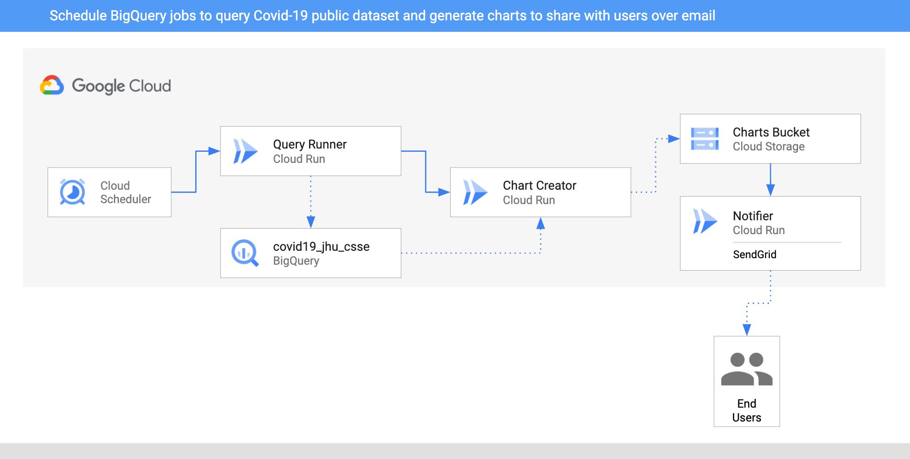

# BigQuery Processing Pipeline - GKE

In this sample, we'll build an BigQuery processing pipeline to query some public
dataset on a schedule, create charts out of the data and then notify users about
the new charts via SendGrid with **Events with Cloud Run on GKE**.



1. Two `CloudSchedulerSources` are setup to call the `QueryRunner` service once
   a day for two countries.
2. `QueryRunner` receives the scheduler event for both country, queries Covid-19
   cases for the country using BigQuery's public Covid-19 dataset and saves the
   result in a separate BigQuery table. Once done, `QueryRunner` returns a custom
   `CloudEvent` of type `dev.knative.samples.querycompleted`.
3. `ChartCreator` receives the `querycompleted` event, creates a chart from
   BigQuery data using `mathplotlib` and saves it to a Cloud Storage bucket.
4. `Notifier` receives the `com.google.cloud.storage.object.finalize` event from
   the bucket via a `CloudStorageSource` and sends an email notification to
   users using SendGrid.

## Set zone and platform

Set some variables to hold your cluster name and zone. For example:

```bash
export CLUSTER_NAME=events-cluster
export CLUSTER_ZONE=europe-west1-b

gcloud config set run/cluster ${CLUSTER_NAME}
gcloud config set run/cluster_location ${CLUSTER_ZONE}
gcloud config set run/platform gke
```

## Create a GKE cluster with Cloud Run Events

Create a GKE cluster with the following addons enabled: CloudRun,
HttpLoadBalancing, HorizontalPodAutoscaling:

```sh
gcloud beta container clusters create ${CLUSTER_NAME} \
  --addons=HttpLoadBalancing,HorizontalPodAutoscaling,CloudRun \
  --machine-type=n1-standard-4 \
  --enable-autoscaling --min-nodes=3 --max-nodes=10 \
  --no-issue-client-certificate --num-nodes=3 --image-type=cos \
  --enable-stackdriver-kubernetes \
  --scopes=cloud-platform,logging-write,monitoring-write,pubsub \
  --zone ${CLUSTER_ZONE} \
  --release-channel=rapid
```

## Setup Cloud Run Events

Setup Cloud Run Events (Control Plane).

```sh
gcloud beta events init
```

If everything is setup correctly, you should see pods running in
`cloud-run-events` and `knative-eventing` namespaces:

```bash
kubectl get pods -n cloud-run-events
kubectl get pods -n knative-eventing
```

Setup Cloud Run Events (Data Plane) with the default namespace.

```sh
export NAMESPACE=default
gcloud beta events namespaces init ${NAMESPACE} --copy-default-secret
```

Create a Broker in the namespace:

```sh
gcloud beta events brokers create default --namespace ${NAMESPACE}
```

Check that the broker is created:

```sh
kubectl get broker -n ${NAMESPACE}
```

## Create a storage bucket

Create a unique storage bucket to save the charts and make sure the bucket and
the charts in the bucket are all public:

```bash
export BUCKET="$(gcloud config get-value core/project)-charts-gke"
gsutil mb gs://${BUCKET}
gsutil uniformbucketlevelaccess set on gs://${BUCKET}
gsutil iam ch allUsers:objectViewer gs://${BUCKET}
```

## Query Runner

This service receives Cloud Scheduler events for each country. It uses BigQuery API
to query for the public Covid19 dataset for those countries. Once done, it saves
the results to a new BigQuery table and passes a custom event onwards.

### Service

The code of the service is in [query-runner](https://github.com/meteatamel/knative-tutorial/tree/master/eventing/processing-pipelines/bigquery/query-runner)
folder.

Inside the top level
[processing-pipelines](.https://github.com/meteatamel/knative-tutorial/tree/master/eventing/processing-pipelines)
folder, build and push the container image:

```bash
export SERVICE_NAME=query-runner
docker build -t gcr.io/$(gcloud config get-value project)/${SERVICE_NAME}:v1 -f bigquery/${SERVICE_NAME}/csharp/Dockerfile .
docker push gcr.io/$(gcloud config get-value project)/${SERVICE_NAME}:v1
```

Deploy the service while passing in `PROJECT_ID` with your actual project id.
This is needed for the BigQuery client:

```bash
gcloud run deploy ${SERVICE_NAME} \
  --image gcr.io/$(gcloud config get-value project)/${SERVICE_NAME}:v1 \
  --update-env-vars PROJECT_ID=$(gcloud config get-value project)
```

### Trigger

The service will be triggered with Cloud Scheduler. More specifically, we will
create two triggers for two countries (United Kingdom and Cyprus) and Cloud
Scheduler will emit `google.cloud.scheduler.job.v1.executed` events once a day
for each country which in turn will call the service.

Set an environment variable for scheduler location, ideally in the same region
as your Cloud Run service. For example:

```bash
export SCHEDULER_LOCATION=europe-west1
```

Create the trigger for UK:

```sh
gcloud beta events triggers create trigger-${SERVICE_NAME}-uk \
  --target-service=${SERVICE_NAME} \
  --type=google.cloud.scheduler.job.v1.executed \
  --parameters location=${SCHEDULER_LOCATION} \
  --parameters schedule="0 16 * * *" \
  --parameters data="United Kingdom"
```

Create the trigger for Cyprus:

```sh
gcloud beta events triggers create trigger-${SERVICE_NAME}-cy \
  --target-service=${SERVICE_NAME} \
  --type=google.cloud.scheduler.job.v1.executed \
  --parameters location=${SCHEDULER_LOCATION} \
  --parameters schedule="0 17 * * *" \
  --parameters data="Cyprus"
```

## Chart Creator

This service receives the custom event from Query Runner, queries the BigQuery
table for the requested country and creates a chart out of the data using
`mathplotlib` library. Finally, the chart is uploaded to a public bucket in
Cloud Storage.

### Service

The code of the service is in [chart-creator](https://github.com/meteatamel/knative-tutorial/tree/master/eventing/processing-pipelines/bigquery/chart-creator)
folder.

Inside the
[chart-creator/python](../eventing/processing-pipelines/bigquery/chart-creator/python)
folder, build and push the container image:

```bash
export SERVICE_NAME=chart-creator
docker build -t gcr.io/$(gcloud config get-value project)/${SERVICE_NAME}:v1 .
docker push gcr.io/$(gcloud config get-value project)/${SERVICE_NAME}:v1
```

Deploy the service while passing in `BUCKET` with the bucket you created earlier.

```bash
gcloud run deploy ${SERVICE_NAME} \
  --image gcr.io/$(gcloud config get-value project)/${SERVICE_NAME}:v1 \
  --update-env-vars BUCKET=${BUCKET}
```

### Trigger

The trigger of the service filters on `dev.knative.samples.querycompleted` event
types which is the custom event type emitted by the query service.

Create the trigger:

```sh
gcloud beta events triggers create trigger-${SERVICE_NAME} \
  --target-service ${SERVICE_NAME} \
  --type=dev.knative.samples.querycompleted \
  --custom-type
```

## Notifier

This service receives the Cloud Storage events from `CloudStorageSource` and
uses SendGrid to send an email to users that a new chart has been created. You
need to setup a SendGrid account and create an API key. You can follow [this
doc](https://cloud.google.com/functions/docs/tutorials/sendgrid#preparing_the_application)
for more details on how to setup SendGrid.

### Service

The code of the service is in
[notifier](https://github.com/meteatamel/knative-tutorial/tree/master/eventing/processing-pipelines/bigquery/notifier)
folder.

Inside the
[notifier/python](../eventing/processing-pipelines/bigquery/notifier/python)
folder, build and push the container image:

```bash
export SERVICE_NAME=notifier
docker build -t gcr.io/$(gcloud config get-value project)/${SERVICE_NAME}:v1 .
docker push gcr.io/$(gcloud config get-value project)/${SERVICE_NAME}:v1
```

Deploy the service while passing in `TO_EMAILS` to email address where you want
to send the notification and `SENDGRID_API_KEY` with your send SendGrid API Key.

```bash
export TO_EMAILS=youremail@gmail.com
export SENDGRID_API_KEY=yoursendgridapikey
gcloud run deploy ${SERVICE_NAME} \
  --image gcr.io/$(gcloud config get-value project)/${SERVICE_NAME}:v1 \
  --update-env-vars TO_EMAILS=${TO_EMAILS},SENDGRID_API_KEY=${SENDGRID_API_KEY},BUCKET=${BUCKET}
```

### Trigger

The trigger of the service filters on `google.cloud.storage.object.v1.finalized` event
which is the event type emitted by the Cloud Storage when a file is saved to the
bucket.

Create the trigger:

```sh
gcloud beta events triggers create trigger-${SERVICE_NAME} \
  --target-service ${SERVICE_NAME} \
  --type=google.cloud.storage.object.v1.finalized \
  --parameters bucket=${BUCKET}
```

## Test the pipeline

Before testing the pipeline, make sure all the triggers are ready:

```bash
gcloud beta events triggers list

   TRIGGER                  EVENT TYPE                                TARGET
✔  trigger-chart-creator    dev.knative.samples.querycompleted        chart-creator
✔  trigger-notifier         google.cloud.storage.object.v1.finalized  notifier
✔  trigger-query-runner-cy  google.cloud.scheduler.job.v1.executed    query-runner
✔  trigger-query-runner-uk  google.cloud.scheduler.job.v1.executed    query-runner
```

You can wait for Cloud Scheduler to trigger the services or you can manually
trigger the jobs.

Find the jobs IDs:

```bash
gcloud scheduler jobs list

ID                                                  LOCATION      SCHEDULE (TZ)          TARGET_TYPE  STATE
cre-scheduler-2bcb33d8-3165-4eca-9428-feb99bc320e2  europe-west1  0 16 * * * (UTC)       Pub/Sub      ENABLED
cre-scheduler-714c0b82-c441-42f4-8f99-0e2eac9a5869  europe-west1  0 17 * * * (UTC)       Pub/Sub      ENABLED
```

Trigger the jobs manually:

```bash
gcloud scheduler jobs run cre-scheduler-2bcb33d8-3165-4eca-9428-feb99bc320e2
gcloud scheduler jobs run cre-scheduler-714c0b82-c441-42f4-8f99-0e2eac9a5869
```

After a minute or so, you should see 2 charts in the bucket:

```bash
gsutil ls gs://${BUCKET}

gs://events-atamel-charts/chart-cyprus.png
gs://events-atamel-charts/chart-unitedkingdom.png
```

You should also get 2 emails with links to the charts!
