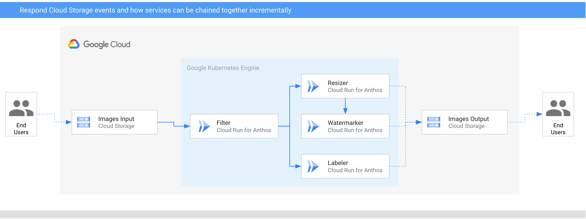

# Image Processing Pipeline - Events with Cloud run on Anthos (GKE)

In this sample, we'll build an image processing pipeline to connect Google Cloud
Storage events to various services with **Events with Cloud run on Anthos (GKE)**.



1. An image is saved to an input Cloud Storage bucket.
2. Cloud Storage update event is read into Cloud Run via `CloudStorageSource`.
3. Filter service receives the Cloud Storage event. It uses Vision API to
   determine if the image is safe. If so, it creates a custom `CloudEvent` of
   type `dev.knative.samples.fileuploaded` and passes it onwards.
4. Resizer service receives the `fileuploaded` event, resizes the image using
   [ImageSharp](https://github.com/SixLabors/ImageSharp) library, saves to the
   resized image to the output bucket, creates a custom `CloudEvent` of type
   `dev.knative.samples.fileresized` and passes the event onwards.
5. Watermark service receives the `fileresized` event, adds a watermark to the
   image using [ImageSharp](https://github.com/SixLabors/ImageSharp) library and
   saves the image to the output bucket.
6. Labeler receives the `fileuploaded` event, extracts labels of the image with
   Vision API and saves the labels to the output bucket.

## Before you begin

Make sure `gcloud` is up to date and `beta` components are installed:

```sh
gcloud components update
gcloud components install beta
```

Set cluster name, zone and platform:

```sh
export CLUSTER_NAME=events-cluster
export CLUSTER_ZONE=europe-west1-b

gcloud config set run/cluster ${CLUSTER_NAME}
gcloud config set run/cluster_location ${CLUSTER_ZONE}
gcloud config set run/platform gke
```

## Create a GKE cluster with Cloud Run Events

Create a GKE cluster with the following addons enabled: CloudRun,
HttpLoadBalancing, HorizontalPodAutoscaling:

```sh
gcloud beta container clusters create ${CLUSTER_NAME} \
  --addons=HttpLoadBalancing,HorizontalPodAutoscaling,CloudRun \
  --machine-type=n1-standard-4 \
  --enable-autoscaling --min-nodes=3 --max-nodes=10 \
  --no-issue-client-certificate --num-nodes=3 --image-type=cos \
  --enable-stackdriver-kubernetes \
  --scopes=cloud-platform,logging-write,monitoring-write,pubsub \
  --zone ${CLUSTER_ZONE} \
  --release-channel=rapid
```

## Setup Cloud Run Events

Setup Cloud Run Events (Control Plane).

```sh
gcloud beta events init
```

If everything is setup correctly, you should see pods running in
`cloud-run-events` and `knative-eventing` namespaces:

```sh
kubectl get pods -n cloud-run-events
kubectl get pods -n knative-eventing
```

Setup Cloud Run Events (Data Plane) with the default namespace.

```sh
export NAMESPACE=default
gcloud beta events namespaces init ${NAMESPACE} --copy-default-secret
```

Create a Broker in the namespace:

```sh
gcloud beta events brokers create default --namespace ${NAMESPACE}
```

Check that the broker is created:

```sh
kubectl get broker -n ${NAMESPACE}
```

## Create storage buckets

Create 2 unique storage buckets to save pre and post processed images:

```sh
export BUCKET1="$(gcloud config get-value core/project)-images-input-gke"
export BUCKET2="$(gcloud config get-value core/project)-images-output-gke"
export BUCKET_LOCATION=europe-west1
gsutil mb -l ${BUCKET_LOCATION} gs://${BUCKET1}
gsutil mb -l ${BUCKET_LOCATION} gs://${BUCKET2}
```

## Setup Cloud Storage for events

Retrieve the Cloud Storage service account:

```sh
export GCS_SERVICE_ACCOUNT=$(curl -s -X GET -H "Authorization: Bearer $(gcloud auth print-access-token)" "https://storage.googleapis.com/storage/v1/projects/$(gcloud config get-value project)/serviceAccount" | jq --raw-output '.email_address')
```

Give the Cloud Storage service account publish rights to Pub/Sub:

```sh
gcloud projects add-iam-policy-binding $(gcloud config get-value project) \
    --member=serviceAccount:${GCS_SERVICE_ACCOUNT} \
    --role roles/pubsub.publisher
```

## Enable Vision API

Some services use Vision API. Make sure the Vision API is enabled:

```sh
gcloud services enable vision.googleapis.com
```

## Filter

This service receives Cloud Storage events for saved images. It uses Vision API
to determine if the image is safe. If so, it passes a custom event onwards.

### Service

The code of the service is in
[filter](https://github.com/meteatamel/knative-tutorial/tree/master/eventing/processing-pipelines/image/filter)
folder.

Inside the top level
[processing-pipelines](https://github.com/meteatamel/knative-tutorial/tree/master/eventing/processing-pipelines)
folder, build and push the container image:

```sh
export SERVICE_NAME=filter
docker build -t gcr.io/$(gcloud config get-value project)/${SERVICE_NAME}:v1 -f image/${SERVICE_NAME}/csharp/Dockerfile .
docker push gcr.io/$(gcloud config get-value project)/${SERVICE_NAME}:v1
```

Deploy the service:

```sh
gcloud run deploy ${SERVICE_NAME} \
  --image gcr.io/$(gcloud config get-value project)/${SERVICE_NAME}:v1
```

### Trigger

The trigger of the service filters on Cloud Storage finalize events:
`google.cloud.storage.object.v1.finalized`.

Create the trigger:

```sh
gcloud beta events triggers create trigger-${SERVICE_NAME} \
  --target-service ${SERVICE_NAME} \
  --type=google.cloud.storage.object.v1.finalized \
  --parameters bucket=${BUCKET1}
```

## Resizer

This service receives the custom event, resizes the image using
[ImageSharp](https://github.com/SixLabors/ImageSharp) library and passes the
event onwards.

### Service

The code of the service is in [resizer](https://github.com/meteatamel/knative-tutorial/tree/master/eventing/processing-pipelines/image/resizer)
folder.

Inside the top level
[processing-pipelines](https://github.com/meteatamel/knative-tutorial/tree/master/eventing/processing-pipelines)
folder, build and push the container image:

```sh
export SERVICE_NAME=resizer
docker build -t gcr.io/$(gcloud config get-value project)/${SERVICE_NAME}:v1 -f image/${SERVICE_NAME}/csharp/Dockerfile .
docker push gcr.io/$(gcloud config get-value project)/${SERVICE_NAME}:v1
```

Deploy the service:

```sh
gcloud run deploy ${SERVICE_NAME} \
  --image gcr.io/$(gcloud config get-value project)/${SERVICE_NAME}:v1 \
  --update-env-vars BUCKET=${BUCKET2}
```

### Trigger

The trigger of the service filters on `dev.knative.samples.fileuploaded` event
types which is the custom event type emitted by the filter service.

Create the trigger:

```sh
gcloud beta events triggers create trigger-${SERVICE_NAME} \
  --target-service ${SERVICE_NAME} \
  --type=dev.knative.samples.fileuploaded \
  --custom-type
```

## Watermark

This service receives the event, adds the watermark to the image using
[ImageSharp](https://github.com/SixLabors/ImageSharp) library and saves the
image to the output bucket.

### Service

The code of the service is in [watermarker](https://github.com/meteatamel/knative-tutorial/tree/master/eventing/processing-pipelines/image/watermarker)
folder.

Inside the top level
[processing-pipelines](https://github.com/meteatamel/knative-tutorial/tree/master/eventing/processing-pipelines)
folder, build and push the container image:

```sh
export SERVICE_NAME=watermarker
docker build -t gcr.io/$(gcloud config get-value project)/${SERVICE_NAME}:v1 -f image/${SERVICE_NAME}/csharp/Dockerfile .
docker push gcr.io/$(gcloud config get-value project)/${SERVICE_NAME}:v1
```

Deploy the service:

```sh
gcloud run deploy ${SERVICE_NAME} \
  --image gcr.io/$(gcloud config get-value project)/${SERVICE_NAME}:v1 \
  --update-env-vars BUCKET=${BUCKET2}
```

### Trigger

The trigger of the service filters on `dev.knative.samples.fileresized` event
types which is the custom event type emitted by the resizer service.

Create the trigger:

```sh
gcloud beta events triggers create trigger-${SERVICE_NAME} \
  --target-service=${SERVICE_NAME} \
  --type=dev.knative.samples.fileresized \
  --custom-type
```

## Labeler

Labeler receives the event, extracts labels of the image with Vision API and
saves the labels to the output bucket.

### Service

The code of the service is in [labeler](https://github.com/meteatamel/knative-tutorial/tree/master/eventing/processing-pipelines/image/labeler)
folder.

Inside the top level
[processing-pipelines](https://github.com/meteatamel/knative-tutorial/tree/master/eventing/processing-pipelines)
folder, build and push the container image:

```sh
export SERVICE_NAME=labeler
docker build -t gcr.io/$(gcloud config get-value project)/${SERVICE_NAME}:v1 -f image/${SERVICE_NAME}/csharp/Dockerfile .
docker push gcr.io/$(gcloud config get-value project)/${SERVICE_NAME}:v1
```

Deploy the service:

```sh
gcloud run deploy ${SERVICE_NAME} \
  --image gcr.io/$(gcloud config get-value project)/${SERVICE_NAME}:v1 \
  --update-env-vars BUCKET=${BUCKET2}
```

### Trigger

The trigger of the service filters on `dev.knative.samples.fileuploaded` event
types which is the custom event type emitted by the filter service.

Create the trigger:

```sh
gcloud beta events triggers create trigger-${SERVICE_NAME} \
  --target-service ${SERVICE_NAME} \
  --type=dev.knative.samples.fileuploaded \
  --custom-type
```

## Test the pipeline

Before testing the pipeline, make sure all the triggers are ready:

```sh
gcloud beta events triggers list

   TRIGGER              EVENT TYPE                                TARGET
✔  trigger-filter       google.cloud.storage.object.v1.finalized  filter
✔  trigger-labeler      dev.knative.samples.fileuploaded          labeler
✔  trigger-resizer      dev.knative.samples.fileuploaded          resizer
✔  trigger-watermarker  dev.knative.samples.fileresized           watermarker
```

You can upload an image to the input storage bucket:

```sh
gsutil cp ../pictures/beach.jpg gs://${BUCKET1}
```

After a minute or so, you should see resized, watermarked and labelled image in
the output bucket:

```sh
gsutil ls gs://${BUCKET2}

gs://events-atamel-images-output/beach-400x400-watermark.jpeg
gs://events-atamel-images-output/beach-400x400.png
gs://events-atamel-images-output/beach-labels.txt
```
