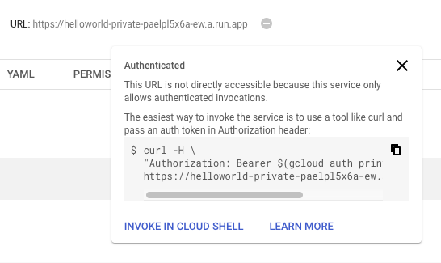

# Private service

Let's deploy a container to non publicly accessible Cloud Run service. We can use the service in [helloworld](../helloworld) folder from before.

## Deploy to Cloud Run

```bash
gcloud beta run deploy \
  --image gcr.io/${PROJECT_ID}/helloworld \
  --platform managed \
  --no-allow-unauthenticated
```
This creates a private Cloud Run service.

## Test the service

If you test the service by visiting the url of the service, you get a 403 Forbidden error:

```bash
curl https://helloworld-private-paelpl5x6a-ew.a.run.app

<html><head>
<meta http-equiv="content-type" content="text/html;charset=utf-8">
<title>403 Forbidden</title>
</head>
<body text=#000000 bgcolor=#ffffff>
<h1>Error: Forbidden</h1>
<h2>Your client does not have permission to get URL <code>/</code> from this server.</h2>
<h2></h2>
</body></html>
```

There's an [Authenticate](https://cloud.google.com/run/docs/authenticating/overview) section in Cloud Run docs that shows how to authenticate for different use cases. 

For testing, you can go to the Cloud Run console and under the service url, you can see an example on how to call the service with the Authorization header:



Try again:

```bash
curl -H \
"Authorization: Bearer $(gcloud auth print-identity-token)" \
https://helloworld-private-paelpl5x6a-ew.a.run.app

Hello World!
```

## What's Next?

[Pub/Sub triggered service](pubsub.md)
