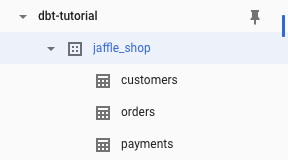
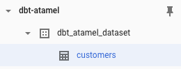
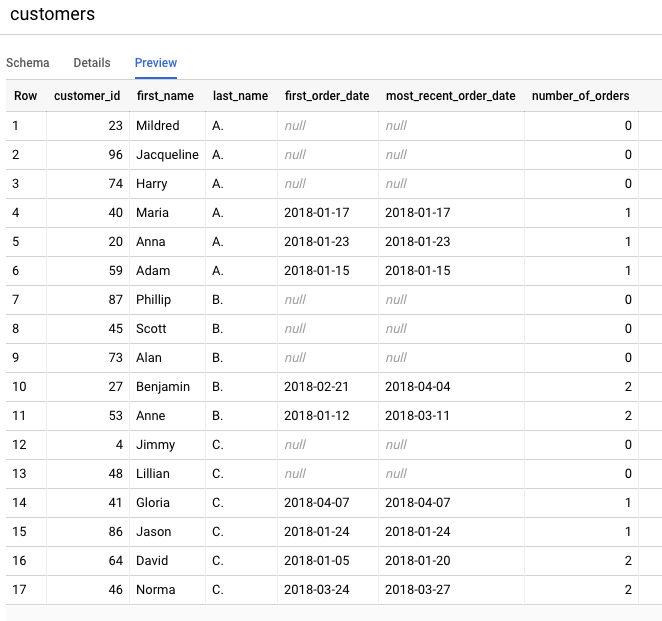

# Scheduled Cloud Run dbt service with BigQuery

[dbt](https://docs.getdbt.com/) is an open source project to build data
transformation pipelines with supported databases such as BigQuery, Postgres,
Redshift and more.

In this sample, I want to show you how to setup a scheduled Cloud Run service
that uses [dbt](https://docs.getdbt.com/) with BigQuery backend.

I'm assuming that you already have a Google Cloud project setup with BigQuery
enabled, you have `gcloud` setup to use that project and you have `dbt`
installed locally.

## Jaffle Shop

For the sample dbt service, we will use
[jaffle-shop](https://github.com/fishtown-analytics/jaffle_shop). `jaffle_shop`
is a fictional ecommerce store with the following tables:


There is already a public project `dbt-tutorial` with a `jaffle_shop` dataset
in BigQuery:



There is also a [tutorial](https://docs.getdbt.com/tutorial/setting-up) in DBT
documentation showing how to transform this dataset with DBT. We will transform
this tutorial into a scheduled service.

## Run dbt locally with BigQuery

We already setup the sample project in [jaffle-shop](../dbt/jaffle-shop)
folder. Feel free to explore it in detail. We'll highlight a few things.

First, [dbt_project.yml](../dbt/jaffle-shop/dbt_project.yml) file has `jaffle_shop` name and
profile. It also has a single `jaffle_shop` model materialized as `table`.

Second, [profiles.yml](../dbt/jaffle-shop/profiles.yml) defines the BigQuery backend for dbt
to connect to. This profile uses oauth for authentication to create a BigQuery
dataset in your project.

Third, [customers.sql](../dbt/jaffle-shop/models/customers.sql) defines the
model for dbt. It reads from `dbt-tutorial` project's `jaffle_shop` dataset and
creates a new transformed customers table.

Run dbt with this new profile:

```sh
$ dbt run --profiles-dir .

Running with dbt=0.17.2
Found 1 model, 0 tests, 0 snapshots, 0 analyses, 147 macros, 0 operations, 0 seed files, 0 sources

16:16:10 | Concurrency: 1 threads (target='dev')
16:16:10 |
16:16:10 | 1 of 1 START table model dbt_atamel_dataset.customers................ [RUN]
16:16:15 | 1 of 1 OK created table model dbt_atamel_dataset.customers........... [CREATE TABLE (100) in 4.84s]
16:16:15 |
16:16:15 | Finished running 1 table model in 9.96s.

Completed successfully

Done. PASS=1 WARN=0 ERROR=0 SKIP=0 TOTAL=1
```

You should see a new dataset and a customers table created in BigQuery:



## Run dbt with Cloud Run

Running dbt on Cloud Run has a few challenges, namely:

1. dbt is mainly a command line tool whereas Cloud Run expects HTTP requests.
   How do you call dbt command from a Cloud Run service?
2. Cloud Run runs containers. How do you run dbt in a container?
3. How do you authenticate dbt with BigQuery? OAuth works for end users but for
   services running in the cloud, it's probably not the right solution.

For #1, Cloud Run has [an
example](https://cloud.google.com/run/docs/quickstarts/build-and-deploy#shell)
on how to run a shell command from an HTTP Server deployed to Cloud Run. It involves
setting up a Go based HTTP server that simply calls a shell script upon receiving a GET
request. You can simply copy that as [invoke.go](../dbt/invoke.go). In our case, the
shell script, [script.sh](../dbt/script.sh) calls dbt with the profile folder.

For #2, dbt has some [base
images](https://hub.docker.com/r/fishtownanalytics/dbt/tags) that you can rely
on (although the documentation is pretty much non-existent). This is a sample
[Dockerfile](../dbt/Dockerfile) that works:

```dockerfile
FROM golang:1.13 as builder
WORKDIR /app
COPY invoke.go ./
RUN CGO_ENABLED=0 GOOS=linux go build -v -o server

FROM fishtownanalytics/dbt:0.17.0
USER root
WORKDIR /dbt
COPY --from=builder /app/server ./
COPY script.sh ./
COPY jaffle-shop ./

ENTRYPOINT "./server"
```

In this Dockerfile, we first build the HTTP server. Then, we use the dbt base
image, copy our dbt project and also the script to call that project with the
profile. Finally, we start the HTTP server to receive requests.

For #3, Cloud Run, by default, uses the Compute Engine default service account
and that should be able to make BigQuery calls. However, it's best practice to assign a
more granular permission to your Cloud Run service by assigning a
dedicated service account with more restricted IAM roles.

In this case, create a service account with `bigquery.admin` role (you probably
want to use even a finer grained role in production):

```sh
export SERVICE_ACCOUNT=dbt-sa
gcloud iam service-accounts create ${SERVICE_ACCOUNT} \
   --display-name "DBT BigQuery Service Account"
gcloud projects add-iam-policy-binding \
  $(gcloud config get-value project) \
  --member=serviceAccount:${SERVICE_ACCOUNT}@$(gcloud config get-value project).iam.gserviceaccount.com \
  --role=roles/bigquery.admin
```

Enable the Cloud Build and Run APIs:

```sh
gcloud services enable run.googleapis.com
gcloud services enable cloudbuild.googleapis.com
```

Build the container:

```sh
export SERVICE_NAME=dbt-service
gcloud builds submit \
  --tag gcr.io/$(gcloud config get-value project)/${SERVICE_NAME}
```

Deploy to Cloud Run with the service account created earlier and also
`no-allow-unauthenticated` flag to make it a private service:

```sh
gcloud run deploy ${SERVICE_NAME} \
    --image gcr.io/$(gcloud config get-value project)/${SERVICE_NAME} \
    --service-account ${SERVICE_ACCOUNT}@$(gcloud config get-value project).iam.gserviceaccount.com \
    --platform managed \
    --no-allow-unauthenticated
```

## Setup Cloud Scheduler

The final step is to call the Cloud Run service on a schedule. You can do this
with Cloud Scheduler.

Enable the Cloud Scheduler API:

```sh
gcloud services enable cloudscheduler.googleapis.com
```

Create a service account for Cloud Scheduler with `run.invoker` role:

```sh
export SERVICE_ACCOUNT=dbt-scheduler-sa
gcloud iam service-accounts create ${SERVICE_ACCOUNT} \
   --display-name "DBT Scheduler Service Account"
gcloud run services add-iam-policy-binding ${SERVICE_NAME} \
   --member=serviceAccount:${SERVICE_ACCOUNT}@$(gcloud config get-value project).iam.gserviceaccount.com \
   --role=roles/run.invoker \
   --platform managed
```

Create a Cloud Scheduler job to call the service every 5 minutes:

```sh
export SERVICE_URL="$(gcloud run services list --platform managed --filter=${SERVICE_NAME} --format='value(URL)')"
gcloud scheduler jobs create http ${SERVICE_NAME}-job --schedule "*/5 * * * *" \
   --http-method=GET \
   --uri=${SERVICE_URL} \
   --oidc-service-account-email=${SERVICE_ACCOUNT}@$(gcloud config get-value project).iam.gserviceaccount.com \
   --oidc-token-audience=${SERVICE_URL}
```

You can test that the service by manually invoking the job:

```sh
gcloud scheduler jobs run ${SERVICE_NAME}-job
```

After a few seconds, you should see the dataset created with a new
customers table in BigQuery:


