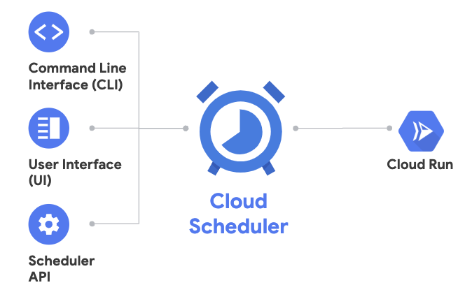

# Scheduled service

You can use Cloud Scheduler to securely trigger a Cloud Run service on a schedule, similar to cron jobs. You can read more about this in Cloud Run [docs](https://cloud.google.com/run/docs/events/using-scheduler).



## Enable Cloud Scheduler

First, make sure the Cloud Scheduler service is enabled in your project:

```bash
gcloud services enable cloudscheduler.googleapis.com
```

## Create a 'Event Display' service

Take a look at the service we already created in [event-display](../event-display) folder. It simply logs out the HTTP request body. We'll use it to display the received messages.

## Build the container

In folder where `Dockerfile` resides, build the container using Cloud Build and push it to Container Registry:

```bash
gcloud builds submit \
  --project ${PROJECT_ID} \
  --tag gcr.io/${PROJECT_ID}/event-display
```

## Deploy to Cloud Run

Note that we're deploying with `no-allow-unauthenticated` flag. We only want Cloud Scheduler to trigger the service:

```bash
export SERVICE_NAME=event-display-scheduled

gcloud run deploy ${SERVICE_NAME} \
  --image gcr.io/${PROJECT_ID}/event-display \
  --platform managed \
  --no-allow-unauthenticated
```

## Setup Cloud Scheduler to trigger Cloud Run

Create a service account:

```bash
export SERVICE_ACCOUNT=cloudrun-scheduler-sa

gcloud iam service-accounts create ${SERVICE_ACCOUNT} \
   --display-name "Cloud Run Scheduler Service Account"
```

Give service account permission to invoke the Cloud Run service:

```bash
gcloud run services add-iam-policy-binding event-display-scheduled \
   --member=serviceAccount:${SERVICE_ACCOUNT}@${PROJECT_ID}.iam.gserviceaccount.com \
   --role=roles/run.invoker
```

## Create a job 

Create a Cloud Scheduler job to execute every 5 minutes:

```bash
export SERVICE_URL="$(gcloud run services list --platform managed --filter=${SERVICE_NAME} --format='value(URL)')"

gcloud beta scheduler jobs create http cloudrun-job --schedule "*/5 * * * *" \
   --http-method=POST \
   --uri=${SERVICE_URL} \
   --oidc-service-account-email=${SERVICE_ACCOUNT}@${PROJECT_ID}.iam.gserviceaccount.com \
   --oidc-token-audience=${SERVICE_URL}
```

## Test the service

You can check the logs of the service to see that it's been triggered by the Cloud Scheduler every 5 mins:

```
12:15:00.578 GMT POST 200 188 B 100 ms Google-Cloud-Scheduler https://event-display-scheduled-pbelpl5x6a-ew.a.run.app/

12:20:00.641 GMT POST 200 188 B 32 ms Google-Cloud-Scheduler https://event-display-scheduled-pbelpl5x6a-ew.a.run.app/
```

## What's Next?

[Task triggered service](tasks.md)